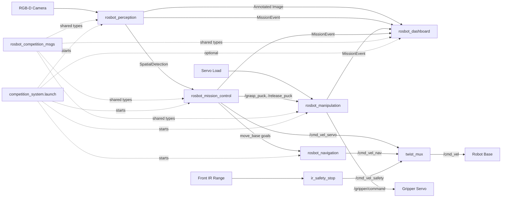

# ROSbot Competition Workspace

Modular ROS Noetic stack for autonomous puck pickup and color-matched delivery, with navigation, perception, manipulation, mission orchestration, and live monitoring.

## What it does

This repository is a Catkin workspace that runs a complete competition pipeline:

1. Detect colored pucks and ArUco drop zones from RGB-D input.
2. Plan and drive to targets.
3. Pick up and release pucks through gripper services.
4. Coordinate behavior with a mission state machine.
5. Stream mission telemetry and annotated vision output to a dashboard.

ROS is intended to run in Docker for reproducible setup on any machine.

## Modules

All core modules live under `src/` as ROS packages:

| Package | Main entrypoints | Responsibility |
| --- | --- | --- |
| `rosbot_competition_bringup` | `launch/competition_system.launch` | Starts and wires the full system; exposes launch toggles (`enable_slam`, `enable_move_base`, `enable_ir_safety`, `enable_dashboard`). |
| `rosbot_navigation` | `launch/navigation.launch`, `scripts/ir_safety_stop.py` | Runs mapping (`slam_toolbox` or `gmapping`), `move_base`, and `twist_mux`; publishes safe robot velocity commands. |
| `rosbot_perception` | `scripts/perception_node.py`, `launch/perception.launch`, `scripts/hsv_calibration.py` | Detects colored pucks + ArUco markers, projects detections to `map`, and publishes annotated camera frames. |
| `rosbot_manipulation` | `scripts/manipulation_node.py`, `launch/manipulation.launch` | Controls gripper open/close and validates grasp success from servo load feedback. |
| `rosbot_mission_control` | `scripts/mission_controller.py`, `launch/mission_controller.launch` | SMACH mission loop (`EXPLORE -> APPROACH -> VISUAL_SERVO -> GRAB -> DELIVER`) that coordinates navigation, perception memory, and gripper services. |
| `rosbot_dashboard` | `scripts/dashboard_node.py`, `launch/dashboard.launch` | PyQt operator UI for annotated camera stream and mission event log (and RViz map when bindings are available). |
| `rosbot_simulation` | `launch/competition_world.launch`, `scripts/spawn_objects.py`, `scripts/sim_manipulation_node.py` | Gazebo competition arena, object spawner, and simulation grasp adapter using `gazebo_ros_link_attacher`. |
| `rosbot_competition_msgs` | `msg/SpatialDetection.msg`, `msg/MissionEvent.msg`, `srv/GraspPuck.srv` | Shared message/service contracts used by perception, mission control, manipulation, and dashboard. |

## Flow of information and commands



## Quick start (Docker)

From repository root:

```bash
docker compose build rosbot-dev
./scripts/docker_catkin_make.sh
```

If you want GUI dashboard support from the container:

```bash
xhost +local:docker
```

Launch the full system:

```bash
docker compose run --rm rosbot-dev bash -lc "source devel/setup.bash && roslaunch rosbot_competition_bringup competition_system.launch"
```

Open an interactive shell inside the ROS container:

```bash
./scripts/docker_shell.sh
```

## Simulation quick start (Gazebo)

1. Import external simulation dependencies:
   ```bash
   ./scripts/docker_vcs_import.sh
   ```
2. Build and source:
   ```bash
   ./scripts/docker_catkin_make.sh
   ```
3. Allow container GUI access:
   ```bash
   xhost +local:docker
   ```
4. Launch full simulation stack:
   ```bash
   ./scripts/docker_sim.sh
   ```

Simulation launch entrypoints:
- `rosbot_competition_bringup/launch/competition_sim.launch` starts Gazebo + full mission stack.
- `rosbot_simulation/launch/competition_world.launch` starts only world + robot + object spawning.

## Key interfaces

| Interface | Type | Produced by | Consumed by | Purpose |
| --- | --- | --- | --- | --- |
| `/perception/spatial_detections` | `rosbot_competition_msgs/SpatialDetection` | Perception | Mission control | Map-frame puck/drop-zone detections. |
| `/perception/annotated_image` | `sensor_msgs/Image` | Perception | Dashboard | Live visual debugging stream. |
| `/mission_events` | `rosbot_competition_msgs/MissionEvent` | Perception, Mission control, Manipulation | Dashboard | Human-readable mission telemetry. |
| `/grasp_puck` | `rosbot_competition_msgs/GraspPuck` (service) | Manipulation | Mission control | Request adaptive grasp for target color. |
| `/release_puck` | `std_srvs/Trigger` (service) | Manipulation | Mission control | Open gripper to release puck. |
| `/cmd_vel` | `geometry_msgs/Twist` | `twist_mux` | Robot base | Final robot velocity command. |

## Configuration files

Important runtime defaults are stored in package-local YAML files:

- `src/rosbot_perception/config/perception.yaml` - camera topics, HSV ranges, ArUco mapping, depth filters.
- `src/rosbot_manipulation/config/manipulation.yaml` - gripper angles, load thresholds, release timing.
- `src/rosbot_mission_control/config/mission.yaml` - waypoint loop and mission behavior defaults.
- `src/rosbot_dashboard/config/dashboard.yaml` - dashboard topics and viewport sizing.
- `src/rosbot_navigation/config/*.yaml` - SLAM/move_base/twist_mux and navigation tuning.

## Repository layout

```text
.
|- docker/
|- scripts/
`- src/
   |- rosbot_competition_bringup/
   |- rosbot_competition_msgs/
   |- rosbot_dashboard/
   |- rosbot_manipulation/
   |- rosbot_mission_control/
   |- rosbot_navigation/
   |- rosbot_perception/
   `- rosbot_simulation/
```

## Notes

- `docker-compose.yml` uses `network_mode: host` so ROS graph discovery works with robot and local network peers.
- Package manifests declare MIT license metadata.

## Smoke test checklist

After `competition_sim.launch` is running:

1. Sensor/data sanity:
   ```bash
   rostopic hz /scan
   rostopic hz /camera/color/image_raw
   rostopic hz /camera/depth/image_raw
   ```
   Expect stable rates above 5 Hz.
2. TF sanity:
   ```bash
   rosrun tf tf_echo map base_link
   ```
   Confirm map and base frames update.
3. Navigation sanity:
   - In RViz, send a `2D Nav Goal`; robot should move and avoid obstacles.
4. Mission sanity:
   - Observe `/mission_events` and confirm at least one full cycle:
     `EXPLORE -> APPROACH -> VISUAL_SERVO -> GRAB -> DELIVER`.
